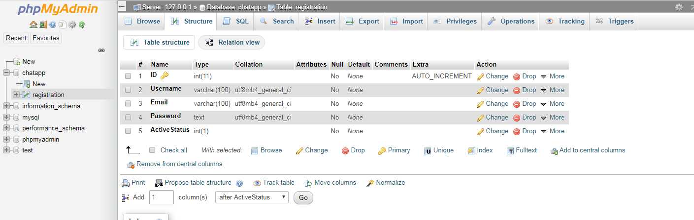

# LoginRegister-with-DataBase
This is a Login/Registeration CRUD app coded in c# with attached mysql database.

## Setup
 - Step1: Run Xampp Apache and Mysql.
 - Step2: Cut and Pase "chatapp" folder in "C:\xampp\mysql\data".
 - Step3: Build and Run.

## Features
 - **Good quality winform GUI**
 - **Custom DataBase to store your user data**
 - **Stores user information and credentials in database**
 - **Retrieve data from database while logging in**

## Here are some screenshot of login/register app.
## Loading Screen

## Login Page

## Registration Page

## Home Page

## Database

IF any queries you can ask me i will try to reply as soon as possible!
